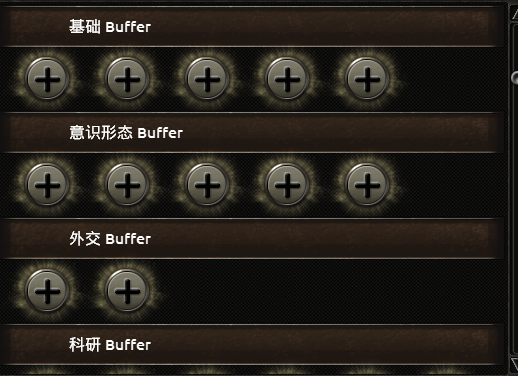
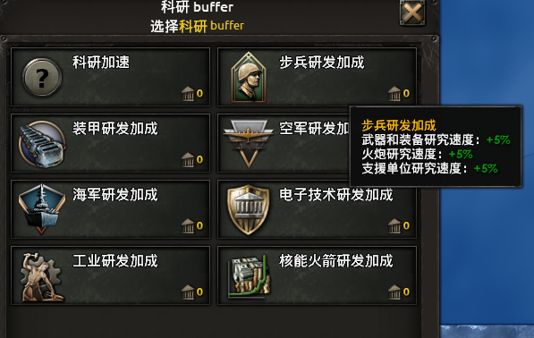
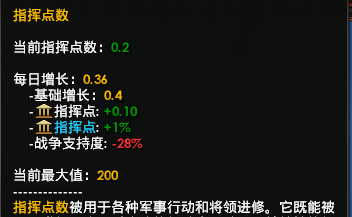
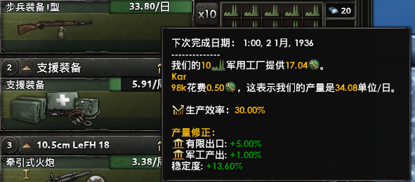

# HOI4Buffers

---

钢4 小幅作弊mod。 相较「大力丸」等强力大范围式作弊 mod，此 mod 尽量保证游戏难度级别下，让玩家可以自行选择小幅度加强某一项数据，以小幅降低游戏难度。

---

## 功能

1. 基础点数增长
	如「政治点」、「稳定度」、「战争支持度」、「三军经验数」
2. 工厂等建筑建造增速
3. 产出产量增长
4. 三军战斗战力增强
5. 情报网建立增速
6. 科技研发增速

### 部分功能截图

---

## 使用

1. 将`main`目录中的文件拷到`mod`目录，
2. 在「播放集」中添加此mod，即可以在游戏中使用此mod了。

